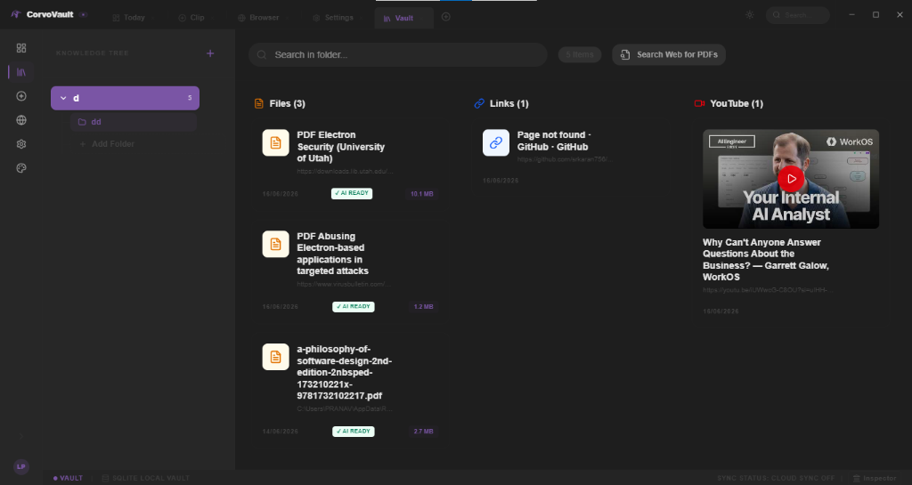
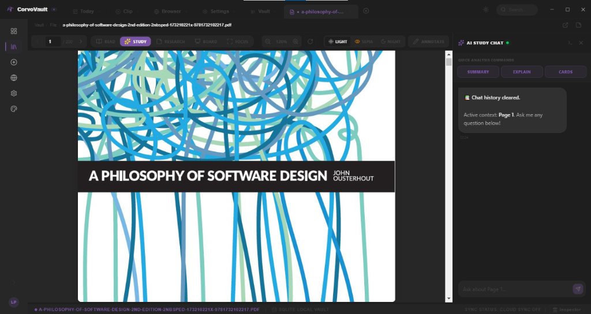
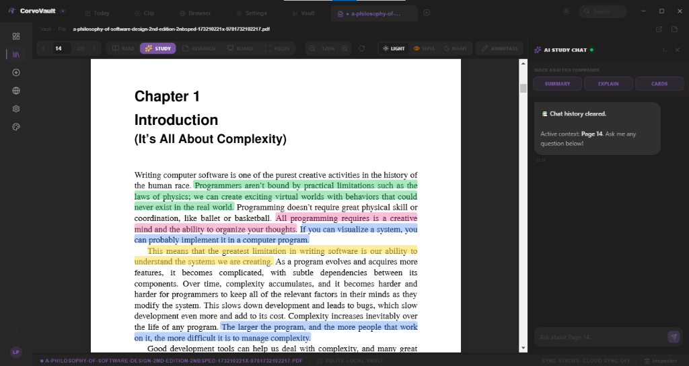

# CorvoVault

**Your little learning partner. A home for curious minds.**

CorvoVault is a local-first desktop application built to support the journey of learning. Instead of treating learning resources as isolated files, CorvoVault connects your PDFs, websites, YouTube videos, research papers, notes, and AI conversations into a single evolving knowledge space designed to help you move from curiosity to understanding. Built with Electron, React, and TypeScript, with all your data staying locally on your machine.


## Screenshots

### Vault 


### PDF Reader & AI Assistant



## What it does

- Organize PDFs, DOCX files, videos, links, and YouTube videos into a topic → folder → material hierarchy
- Read PDFs in a custom built-in viewer with text selection, highlighting, freehand drawing, zoom, rotation, and reading filters
- Preview DOCX/ODT/RTF files inline (converted via bundled Pandoc to PDF)
- Take and save notes per material with a rich text editor
- Track YouTube video watch progress
- Browse the web inside the app in an isolated session
- Search the web for PDFs and download them directly into the vault
- Chat with an AI tutor about the document you are reading (requires your own API key) — *Experimental / Explorer Feature*
- View a study dashboard with time-tracked activity, heatmap, and usage stats
- Multiple local profiles on one installation, each with its own vault, settings, and theme

## Tech stack

- Electron 35 (main + preload processes)
- React 19 + Vite 6 (renderer)
- TypeScript 5.8
- SQLite via `better-sqlite3` (WAL mode)
- Tailwind CSS 4
- `@xenova/transformers` — ONNX runtime for local embedding generation (no GPU required)

## Getting started (development)

**Prerequisites**

- Windows 10 or later
- Node.js 18 or later
- `pandoc.exe` present in `resources/pandoc/` (required for DOCX preview)

**Install dependencies**

```bash
npm install
```

The `postinstall` script rebuilds native modules (`better-sqlite3`, `keytar`) against Electron automatically. If it fails, run:

```bash
npm run electron:rebuild
```

**Start the development environment**

```bash
npm run electron:dev
```

This starts both the Vite dev server (at `http://127.0.0.1:3000`) and Electron concurrently.

**Run unit tests**

```bash
npm test
```

## Build and package

```bash
npm run electron:build
```

Output is written to `release/`. The app packages as an NSIS installer for Windows.

## Repository layout

```
corvovault/
├── electron/     # Main process: IPC handlers, services, repositories, DB
├── src/          # Renderer: React components, hooks, contexts, lib
├── shared/       # IPC envelope types shared between main and renderer
├── docs/         # Engineering documentation
└── resources/    # Bundled binaries (pandoc.exe)
```

See [`PROJECT_VISION.md`](PROJECT_VISION.md) for the philosophy, goals, and principles of the application. See [`ENGINEERING.md`](ENGINEERING.md) for architecture, subsystem details, and known issues. For customizing colors and the user interface, see [`docs/THEME_DESIGN_GUIDE.md`](docs/THEME_DESIGN_GUIDE.md).

## Database

Migration scripts run automatically on startup. The migration runner (`electron/db/migrate.ts`) embeds SQL inline — the `.sql` files in `electron/db/migrations/` are reference copies, not what the runner executes.

## Notes to Others

- Ignore the dashboard for now, because I'm planning something different for that.
- **AI Tutor & RAG Chat**: This feature is highly experimental and exploratory. The local-first vector RAG pipeline and remote LLM agentic tool-use loops contain rough edges (such as tool execution compliance, page number hallucinations, context window limits, and fallback JSON parsing). Expect inconsistencies—it is currently just an experiment.
- If you want to work as a team and improve this (not just fixing some bugs), you can personally email me at kshivamraj756@gmail.com or WhatsApp me at 7970704703 and just say - hey npm run build togather.

## Contributing

- Open issues for bugs or feature requests.
- Follow existing patterns when adding services or IPC handlers.
- Run migrations after any schema change.

## Troubleshooting

| Symptom | Likely cause | Fix |
|---------|-------------|-----|
| `NODE_MODULE_VERSION mismatch` on startup | Native modules built against wrong Node ABI | Run `npm run electron:rebuild` |
| Blank renderer screen | Vite server not running | Use `npm run electron:dev`, not `electron:start` alone |
| DOCX preview fails | `pandoc.exe` missing | Confirm `resources/pandoc/pandoc.exe` exists |

## License

See [`LICENSE`](LICENSE) in the repository root.
