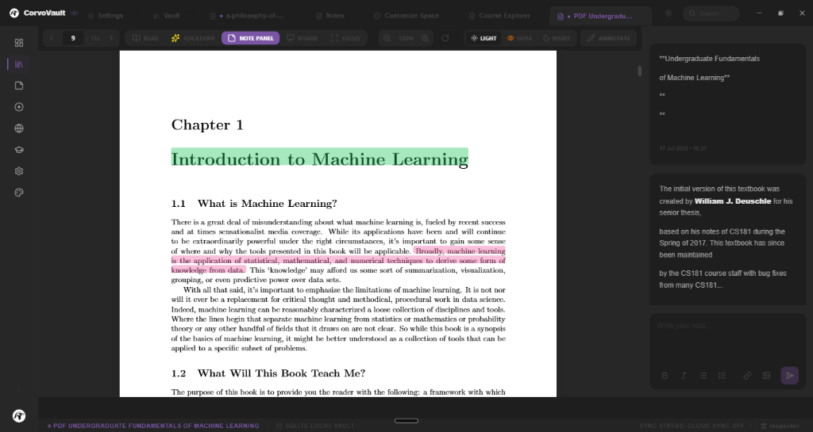
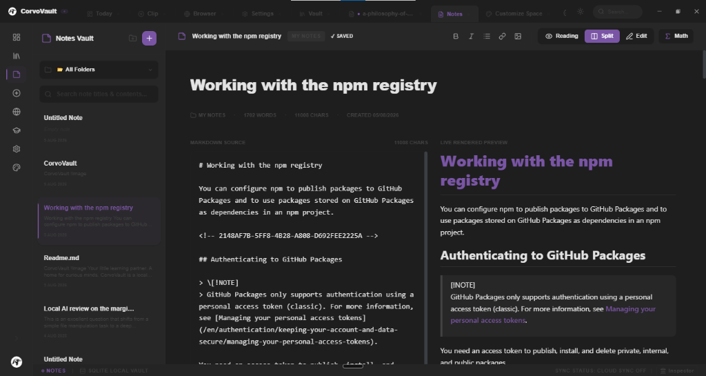

<div align="center">


# CorvoVault

**A local study workspace for organizing, reading, and working with learning materials.**

[Project Status](PROJECT_STATUS.md) · [Architecture](ARCHITECTURE.md) · [Development Setup](DEVELOPMENT_WORKFLOW.md)

</div>

CorvoVault is an actively developed Electron desktop application for organizing local study materials. The current application supports local vault organization, PDF viewing and annotation, Markdown notes, profiles, bookmarks, and an embedded browser.

Several advanced systems, including local embeddings, AI-assisted retrieval, course workflows, analytics, OCR, and synchronization, are incomplete, experimental, or disabled by default. See [PROJECT_STATUS.md](PROJECT_STATUS.md) for the current state of each subsystem.

## Interface preview

The following screenshots show implemented application surfaces. They are representative interface views, not a complete feature list or a claim that every advanced subsystem is production-ready.

### PDF reading and annotation



The custom PDF reader supports document navigation, reading modes, text selection, and annotation workflows. Some edge cases remain under development.

### Local vault and notes

<table>
  <tr>
    <td width="50%"></td>
    <td width="50%"></td>
  </tr>
  <tr>
    <td align="center">Local topics, folders, and materials</td>
    <td align="center">Markdown notes and rendered study content</td>
  </tr>
</table>

## Development setup

Prerequisites: Node.js 20 or later, npm, and the bundled Pandoc resource for document preview work.

```bash
npm ci
npm run electron:dev
```

Useful checks:

```bash
npm run typecheck
npm run typecheck:electron
npm test
npm run build
```

See [DEVELOPMENT_WORKFLOW.md](DEVELOPMENT_WORKFLOW.md) for the complete local workflow.

## Documentation

- [Project status](PROJECT_STATUS.md)
- [Product philosophy](PRODUCT_PHILOSOPHY.md)
- [Architecture](ARCHITECTURE.md)
- [Decision log](DECISION_LOG.md)
- [Development workflow](DEVELOPMENT_WORKFLOW.md)
- [Release process](RELEASE_PROCESS.md)
- [Contributing](CONTRIBUTING.md)
- [Security policy](SECURITY.md)
- [Technical guides](docs/README.md)

## License

CorvoVault is licensed under the [Apache License 2.0](LICENSE).
