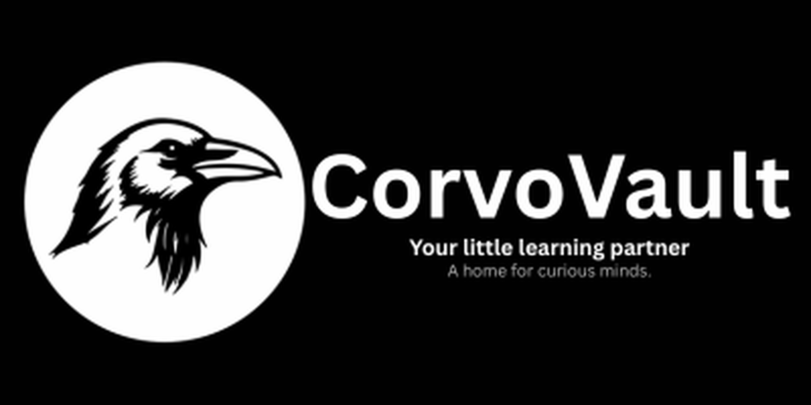
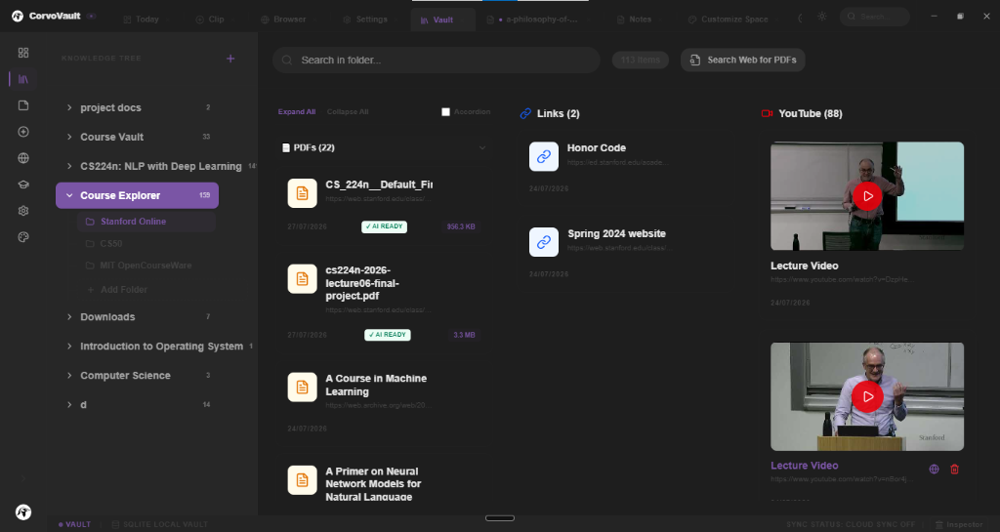
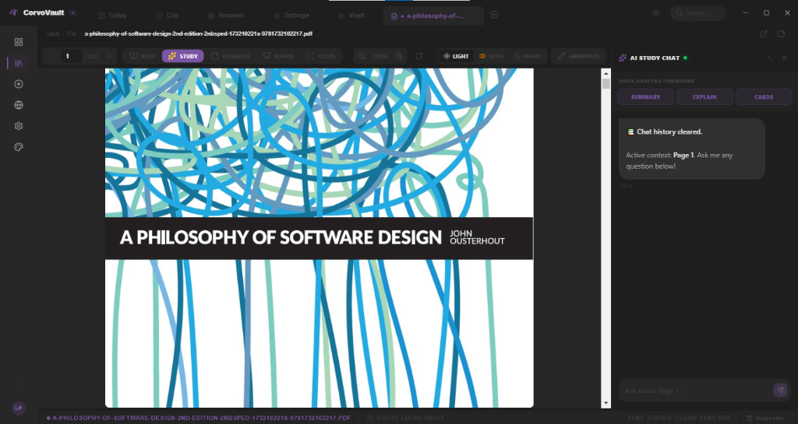
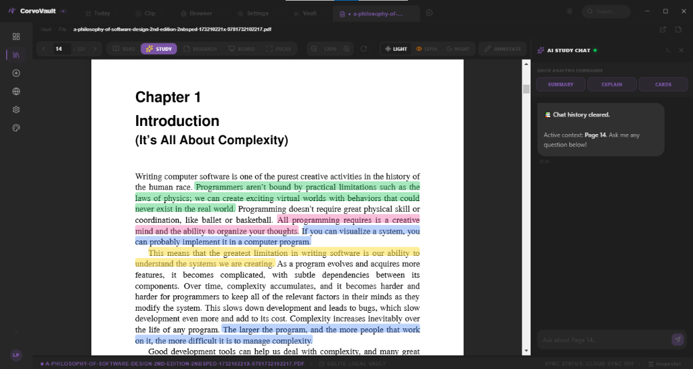

<div align="center">

  

  # CorvoVault

  **Your little learning partner. A home for curious minds.**

  *The local-first, privacy-focused knowledge workspace that unifies PDFs, research papers, course materials, notes, YouTube videos, and AI tutoring into one connected sanctuary.*

  <p align="center">
    <a href="#-key-features"><strong>Explore Features</strong></a> •
    <a href="#-getting-started-development"><strong>Quick Start</strong></a> •
    <a href="#-architectural-guides--documentation"><strong>Architecture Docs</strong></a> •
    <a href="#-contributing"><strong>Contributing</strong></a>
  </p>

  <p align="center">
    
    
    
    
    
    
  </p>

  ---
</div>

## 💡 Overview

Learning is not linear—it spans across PDFs, research papers, online courses, technical documentation, notes, and video lectures. Traditional tools force you to fragment your context across separate browser tabs, PDF viewers, and note apps.

**CorvoVault** changes that. It is a desktop sanctuary engineered to keep your thoughts, study materials, and AI insights in total sync. With a local-first SQLite vector engine and local ONNX embeddings, your research and private notes stay **100% on your machine**.

---

## 📸 Interface Preview

<div align="center">

| **Knowledge Vault & Course Workspaces** |
|:---:|
|  |
| *Organize study tracks, topics, documents, notes, and course resources in a single unified dashboard.* |

<br />

| **Custom PDF Reader & Annotations** | **Contextual AI Tutor & Research RAG** |
|:---:|:---:|
|  |  |
| *High-speed document viewer with reading filters, highlight management, and freehand markup.* | *Deep hybrid semantic search (BM25 + `sqlite-vec`) for intelligent contextual Q&A.* |

</div>

---

## ✨ Key Features

### 🗂️ 1. Unified Knowledge Vault
- **Organized Hierarchy**: Structure study tracks into `Topic → Folder → Material` trees.
- **Multi-Format Support**: Native handling for PDFs, DOCX/ODT/RTF (via bundled Pandoc converter), Markdown notes, web URLs, and YouTube videos.
- **Multiple Local Profiles**: Support for isolated profiles on one machine—each with its own vault database, configuration, and visual theme.

### 📄 2. Custom PDF Engine & Annotation Studio
- **Ergonomic Reader**: Smooth page navigation, zooming, rotation, continuous scroll, and thumbnail sidebars.
- **Reading Themes**: Light, Sepia, and Night/Dark reader filters designed for long study sessions.
- **Interactive Annotations**: Highlight key passages, draw freehand notes, and extract text instantly using built-in OCR (PaddleOCR engine).

### 🤖 3. Local-First Hybrid AI Tutor (RAG Engine)
- **Local Vectors**: Powered by `@xenova/transformers` ONNX runtime for on-device embedding generation without requiring a discrete GPU.
- **Hybrid Vector Search**: Combines BM25 keyword matching with `sqlite-vec` vector similarity via Reciprocal Rank Fusion (RRF) for ultra-accurate document retrieval.
- **Contextual Q&A**: Ask questions about your open documents, summarize complex papers, and generate flashcards locally.

### 🌐 4. Privacy Web Browser & In-App YouTube Player
- **Isolated Browser Tabs**: Built-in Chromium webview tabs with domain render caching, history tracking, and download management.
- **Deep Ignoto DNS-over-HTTPS**: Encrypted DNS resolution for secure web navigation.
- **YouTube Rescue Player & Multi-Layer Adblocker**: Seamless video playback with progress tracking, Ghostery network filtering, and InnerTube API JSON payload sanitization (`/youtubei/v1/player`).

### 📝 5. Standalone Notes Studio
- **Rich Markdown Editing**: Full support for GFM markdown with live preview.
- **Mathematical Equations**: Native LaTeX rendering powered by KaTeX (`$...$`, `$$...$$`).
- **Diagrams & Visuals**: Live Mermaid.js diagram generation and instant web image embedding.

---

## ⚡ Tech Stack

CorvoVault is built on a modern, high-performance desktop stack:

| Component | Technology | Description |
|---|---|---|
| **Runtime & Shell** | [Electron 35](https://www.electronjs.org/) | Multi-process desktop container with secure IPC bridge and isolated webviews |
| **Frontend Framework** | [React 19](https://react.dev/) + [Vite 6](https://vitejs.dev/) | Fast, modular component architecture with instant HMR dev experience |
| **Language** | [TypeScript 5.8](https://www.typescriptlang.org/) | End-to-end strict type safety across main, preload, and renderer layers |
| **Database & Vector DB**| [`better-sqlite3`](https://github.com/WiseLibs/better-sqlite3) + [`sqlite-vec`](https://github.com/asgregory/sqlite-vec) | High-speed local SQLite storage in WAL mode with native vector extension |
| **Local AI Embeddings**| [`@xenova/transformers`](https://github.com/xenova/transformers.js) | On-device ONNX runtime embedding pipeline (no cloud or GPU required) |
| **Styling & Theme System**| [Tailwind CSS 4](https://tailwindcss.com/) | Modern utility-first CSS design system with dynamic HSL theme overrides |
| **Document Tools** | [KaTeX](https://katex.org/), [Mermaid](https://mermaid.js.org/), [Pandoc](https://pandoc.org/) | Mathematical typesetting, live diagramming, and document format conversion |

---

## 🚀 Getting Started (Development)

### Prerequisites
- **Operating System**: Windows 10/11, macOS, or Linux
- **Node.js**: Version 18.0 or higher
- **Pandoc** (Included): `pandoc.exe` is bundled under `resources/pandoc/` for inline DOCX conversion.

### 1. Clone the Repository
```bash
git clone https://github.com/srkaran756/CorvoVault.git
cd CorvoVault
```

### 2. Install Dependencies
```bash
npm install
```

### 3. Launch Development Server
```bash
npm run electron:dev
```
*This command fires up the Vite HMR renderer server and launches the Electron main process concurrently.*

---

## 📚 Architectural Guides & Documentation

We believe in complete transparency and clean architecture. Dive into our dedicated technical guides:

- 🏗️ **[Engineering Specification](ENGINEERING.md)** — Deep dive into system architecture, IPC contracts, state management, and 16 database migrations.
- 🤝 **[Contributing Guide](CONTRIBUTING.md)** — Developer environment setup, coding standards, IPC safety rules, and PR checklist.
- 🌐 **[In-App Browser & Adblocker Guide](docs/IN_APP_BROWSER_GUIDE.md)** — Architecture of multi-process webview tabs and 3-layer YouTube ad-blocking mechanism.
- 🧠 **[AI System Architecture](docs/AI_SYSTEM.md)** — Local ONNX embedding pipeline, hybrid vector search (BM25 + `sqlite-vec` + RRF), and agent tool loops.
- ⚡ **[Performance & RAM Guide](docs/PERFORMANCE_AND_RAM_GUIDE.md)** — Memory analysis, process breakdown, and webview RAM management.
- 🎨 **[Theme & Design System](docs/THEME_DESIGN_GUIDE.md)** — HSL CSS variable token system and custom theme overrides.
- 🎯 **[Project Vision & Philosophy](PROJECT_VISION.md)** — The long-term vision behind CorvoVault as a learning sanctuary.

---

## 🔧 Troubleshooting

| Symptom | Likely Cause | Resolution |
|---|---|---|
| `NODE_MODULE_VERSION mismatch` error on launch | Native modules built against wrong Node/Electron ABI | Run `npm run electron:rebuild` |
| Blank renderer window | Vite dev server not ready or stopped | Launch app with `npm run electron:dev` |
| DOCX preview fails | `pandoc.exe` missing from resources | Ensure `resources/pandoc/pandoc.exe` is present |

---

## 📄 License

CorvoVault is licensed under the [Apache License 2.0](LICENSE).

---

<div align="center">
  <sub>Built with ❤️ for curious minds and lifelong learners worldwide.</sub>
</div>
