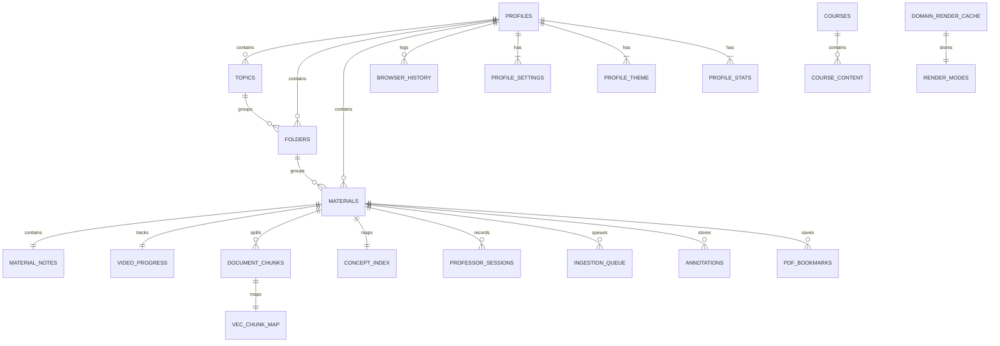
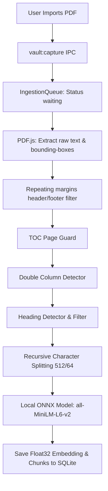
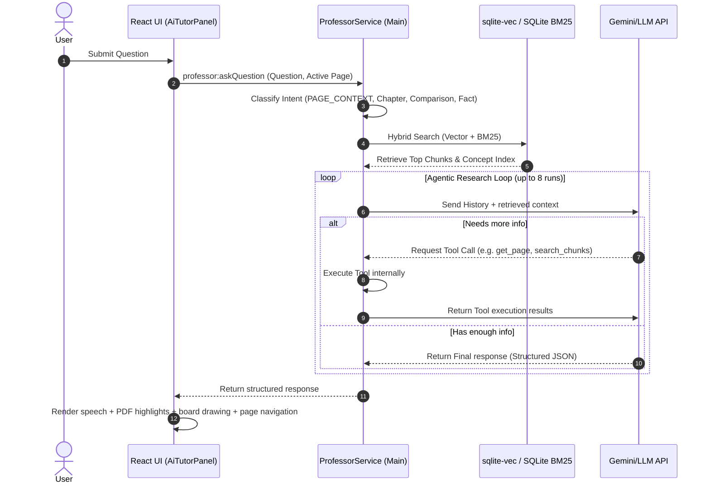

# CorvoVault Software Design Document

CorvoVault is a local-first desktop application designed to support the journey of learning by integrating PDFs, website material, notes, and AI conversations into a single connected knowledge space.

---

## 1. High-Level Architecture

CorvoVault is built on the **Electron** desktop shell framework, implementing a decoupled multi-process architecture. This ensures that heavy database and machine learning tasks do not block renderer-based UI execution.

```mermaid
graph TD
    subgraph Renderer Process [Renderer Process (Chromium)]
        ReactUI[React UI Components]
        IPCService[ipcService.ts Client]
        PDFViewer[Custom PDF Viewer / Selection Engine]
        AITutor[AI Tutor Panel]
        NotesWorkspace[Standalone Notes / NotesWorkspace]
        MarkdownRenderer[MarkdownRenderer KaTeX & Mermaid]
        CourseWorkspace[CourseWorkspace & CourseExplorer]
    end

    subgraph Preload Bridge [Preload Bridge]
        Preload[preload.ts / window.electronAPI]
    end

    subgraph Main Process [Main Process (Node.js)]
        Main[main.ts / Window & File Handlers]
        IPCHandlers[IPC Handlers]
        ServiceHost[ServiceHost Composition Root]
        FeatureFlags[electron/config/featureFlags.ts]
        
        subgraph Application Services
            VaultService[VaultService]
            ProfessorService[ProfessorService]
            IngestionQueue[IngestionQueue]
            SecretService[SecretService]
            CourseService[courseExtractionService.ts]
            OCRService[ocrHandlers.ts / ignotoProxy]
        end
        
        subgraph Infrastructure & DB
            SQLiteDB[(SQLite DB / WAL Mode)]
            SqliteRepositories[Sqlite Repositories]
            SqliteVec[(sqlite-vec Extension)]
            LocalFiles[(Local Files System)]
            ONNXEmbed[Local ONNX Embedding Model]
        end
    end

    ReactUI --> IPCService
    NotesWorkspace --> MarkdownRenderer
    CourseWorkspace --> IPCService
    IPCService --> Preload
    Preload --> IPCHandlers
    IPCHandlers --> ServiceHost
    IPCHandlers --> FeatureFlags
    ServiceHost --> VaultService
    ServiceHost --> ProfessorService
    ServiceHost --> IngestionQueue
    ServiceHost --> SecretService
    ServiceHost --> CourseService
    ServiceHost --> OCRService
    
    VaultService --> SqliteRepositories
    ProfessorService --> SqliteRepositories
    IngestionQueue --> SqliteRepositories
    CourseService --> SQLiteDB
    
    SqliteRepositories --> SQLiteDB
    IngestionQueue --> ONNXEmbed
    IngestionQueue --> LocalFiles
    ProfessorService --> SqliteVec
```

### 1.1 Process Decomposition

1. **Main Process (Node.js & Electron APIs)**
   - Responsible for system startup, lifecycle management, window creation, custom file protocols, native dialogs, and auto-updating.
   - Holds the database connection to SQLite (`better-sqlite3`), dynamically loads the native `sqlite-vec` extension, and manages background ingestion queues.
   - Performs ONNX-based local vector embeddings generation and converts non-PDF formats (such as DOCX) to previewable PDFs.
2. **Renderer Process (Chromium & React)**
   - Standard sandboxed window rendering React components styled using Tailwind CSS 4.
   - Manages tabs, renders the custom PDF viewer canvas, hosts the embedded webview, and handles remote LLM orchestration for the AI Tutor panel.
3. **Preload Script Bridge (`preload.ts`)**
   - The security boundary between sandboxed Chromium and the privileged Main process.
   - Exposes safe interfaces via `window.electronAPI` while enforcing `contextIsolation: true`, `nodeIntegration: false`, and `sandbox: true`.

---

## 2. Data Architecture

CorvoVault operates on a **local-first** storage paradigm. App data and configurations live in `userData` directory of the OS.

### 2.1 Database Configuration

- **Engine**: SQLite (via `better-sqlite3`)
- **Location**: `app.getPath('userData')/corvovault.db`
- **Performance Tunings**:
  - `journal_mode = WAL` (Write-Ahead Logging for concurrent reads and writes)
  - `synchronous = NORMAL` (Reduced filesystem sync overhead without corruption risk in WAL mode)
  - `foreign_keys = ON` (Cascading deletes across tables)

### 2.2 Schema Definitions



#### `courses` (Migrations 012 & 013)
Stores online courses and scraped lesson items.
- `id` (TEXT, PK)
- `title` (TEXT, NOT NULL)
- `provider` (TEXT, NOT NULL)
- `providerCourseId` (TEXT, NOT NULL)
- `officialUrl` (TEXT, NOT NULL)
- `thumbnail` / `description` / `language` / `duration` / `instructor` / `university` (TEXT, Nullable)
- `isFree` (INTEGER, NOT NULL DEFAULT 1)
- `rating` (REAL, Nullable)
- `content` (TEXT, JSON string of lesson items)

#### `browser_history` (Migration 014)
Stores isolated web browser navigation history logs per profile.
- `id` (TEXT, PK)
- `profile_id` (TEXT, FK -> `profiles.id` ON DELETE CASCADE)
- `title` (TEXT, Nullable)
- `url` (TEXT, NOT NULL)
- `created_at` (INTEGER, NOT NULL)

#### `domain_render_cache` (Migration 015)
Stores site-specific webview rendering overrides.
- `domain` (TEXT, PK)
- `render_type` (TEXT, NOT NULL)
- `updated_at` (INTEGER, NOT NULL)

#### `profiles`
Stores local user profiles. `current = 1` identifies the active workspace profile.
- `id` (TEXT, PK)
- `name` (TEXT, NOT NULL)
- `avatar_path` (TEXT, Nullable)
- `created_at` (INTEGER, NOT NULL)
- `current` (INTEGER, NOT NULL DEFAULT 0)

#### `topics`
Organizes materials by subject under a profile.
- `id` (TEXT, PK)
- `profile_id` (TEXT, FK -> `profiles.id` ON DELETE CASCADE)
- `name` (TEXT, NOT NULL)
- `created_at` (INTEGER, NOT NULL)

#### `folders`
Organizes files under topics.
- `id` (TEXT, PK)
- `topic_id` (TEXT, FK -> `topics.id` ON DELETE CASCADE)
- `profile_id` (TEXT, FK -> `profiles.id` ON DELETE CASCADE)
- `name` (TEXT, NOT NULL)
- `created_at` (INTEGER, NOT NULL)

#### `materials`
Holds metadata for documents, links, notes, and YouTube videos.
- `id` (TEXT, PK)
- `folder_id` (TEXT, FK -> `folders.id` ON DELETE CASCADE)
- `profile_id` (TEXT, FK -> `profiles.id` ON DELETE CASCADE)
- `box_type` (TEXT, NOT NULL) - e.g., `file`, `link`, `youtube`, `note`
- `title` (TEXT, Nullable)
- `url` (TEXT, Nullable)
- `local_path` (TEXT, Nullable)
- `storage_status` (TEXT, NOT NULL DEFAULT 'active')
- `file_hash` (TEXT, Nullable)
- `file_size` (INTEGER, Nullable)
- `trashed_at` (INTEGER, Nullable)
- `trash_path` (TEXT, Nullable)
- `created_at` (INTEGER, NOT NULL)

#### `document_chunks`
Stores text segments extracted from PDFs along with their layout bounding boxes and structural identifiers.
- `chunk_id` (TEXT, PK)
- `material_id` (TEXT, FK -> `materials.id` ON DELETE CASCADE)
- `page` (INTEGER, NOT NULL)
- `section` (TEXT, Nullable)
- `chunk_type` (TEXT, NOT NULL)
- `text` (TEXT, NOT NULL)
- `bbox_x` / `bbox_y` / `bbox_w` / `bbox_h` (REAL, Nullable)
- `embedding` (BLOB, Nullable Float32 vector)
- `chunk_order` (INTEGER, NOT NULL)
- `created_at` (INTEGER, NOT NULL)
- `chapter_id` (TEXT, Nullable)
- `raw_text` (TEXT, Nullable)
- `parent_summary_id` (TEXT, Nullable)
- `is_toc` (INTEGER, NOT NULL DEFAULT 0)

#### `concept_index`
Stores the semantic layout index and status maps computed during document ingestion.
- `material_id` (TEXT, PK, FK -> `materials.id` ON DELETE CASCADE)
- `index_json` (TEXT, NOT NULL DEFAULT '{}')
- `status` (TEXT, NOT NULL DEFAULT 'not_started')
- `error_message` (TEXT, Nullable)
- `total_chunks` (INTEGER, DEFAULT 0)
- `created_at` / `updated_at` (INTEGER, NOT NULL)

#### `annotations`
Stores highlights, strikes, freehand drawings, and notes created on a PDF.
- `annotation_id` (TEXT, PK)
- `material_id` (TEXT, FK -> `materials.id` ON DELETE CASCADE)
- `chunk_id` (TEXT, FK -> `document_chunks.chunk_id` ON DELETE SET NULL)
- `page` (INTEGER, NOT NULL)
- `type` (TEXT, NOT NULL) - e.g., `highlight`, `strikeout`, `drawing`
- `target_text` (TEXT, Nullable)
- `color` (TEXT, NOT NULL DEFAULT 'orange')
- `callout` (TEXT, Nullable)
- `bbox_x` / `bbox_y` / `bbox_w` / `bbox_h` (REAL, Nullable)
- `stroke_data` (TEXT, Nullable JSON coordinates for drawing)
- `source` (TEXT, NOT NULL DEFAULT 'user')
- `created_at` (INTEGER, NOT NULL)

#### `vec_chunks` (Virtual Table)
Virtual vector index loaded at runtime by `sqlite-vec` dynamically referencing chunk vector embeddings:
```sql
CREATE VIRTUAL TABLE vec_chunks USING vec0(embedding float[384]);
```

### 2.3 Filesystem Storage Layout
- `userData/local-files/`: Stores imported files, prefixed with timestamps to prevent naming collisions.
- `userData/local-files/.trash/`: Isolated directory holding soft-deleted files awaiting purge.
- `userData/previews/`: Temporary location containing generated HTML and PDF files used for DOCX and other format previews.
- `userData/ai-models/`: Quantized local ONNX model caches (`Xenova/all-MiniLM-L6-v2` files).
- `userData/secrets_store.json`: Encrypted API keys stored using Electron's `safeStorage`.

---

## 3. Core Feature Subsystem Designs

### 3.1 Background Ingestion & Local Embedding Pipeline

To enable local search and RAG queries, imported files undergo background ingestion that splits, filters, and indexes text coordinates.



1. **Verbatim Bounding-Box Extraction**: Utilizing `pdfjs-dist`, character coordinates ($X, Y, W, H$) are normalized relative to the page viewport bounds $[0.0 - 1.0]$.
2. **Repeating Margins & Headers Stripping**: Pages are analyzed to identify repeating strings (like page numbers or headers) to exclude noisy headers/footers from RAG contexts.
3. **TOC Guard & Column Correction**: Pages containing Table of Contents syntax are marked to prevent semantic noise. Multi-column PDF grids are dynamically re-ordered to read text vertically down columns before moving horizontally.
4. **Local ONNX Embedding**: Text fragments are partitioned using LangChain's `RecursiveCharacterTextSplitter` configured for a maximum of 512 characters and 64 character overlap. These text chunks are passed to the CPU-quantized local model `all-MiniLM-L6-v2` via `@xenova/transformers`, outputting a 384-dimensional vector.
5. **Storage**: Vector floats are stored as SQLite blobs mapped to `vec_chunk_map` and virtual tables.

### 3.2 Hybrid RAG Retrieval (Intent Routing & RRF)



1. **Intent Classification**:
   - The user query is mapped to search scopes like `PAGE_CONTEXT` ($\pm 2$ pages from active viewer page), `CHAPTER_SUMMARY`, `COMPARISON`, or `GENERAL_SEMANTIC`.
2. **Hybrid Ranking (RRF)**:
   - Evaluates keyword matching using BM25 alongside semantic vector mapping.
   - Merges results using Reciprocal Rank Fusion (RRF):
     $$RRF\_Score = \frac{1}{60 + rank_{BM25}} + \frac{1}{60 + rank_{Vector}}$$
   - Applies weight boosts based on the student's active reading page or targeted chapter contexts.
3. **Agentic Tool Loop**:
   - Instead of a single-shot prompt, the AI Tutor behaves as an agent, iterating through tools like `search_chunks(query)`, `get_page(page_number)`, and `get_topic(topic_name)` to build deep context.
4. **Visual Synchronization**:
   - The LLM responds in a structured JSON payload detailing raw speech (markdown), page locations to navigate, custom page coordinates to highlight, and drawing steps to render on the virtual chalkboard.

### 3.3 Custom PDF Selection & Annotation Engine

Rendering is managed by canvas layers inside React. To overcome coordinate translation issues during zooming and window resizing, coordinates are transformed dynamically:

$$\text{Viewport Position} = \text{Normalized Coordinate} \times \text{Canvas Viewport Dimensions} \times \text{Zoom Level}$$

- **Selection Engine (`pdfSelectionEngine.ts`)**: Takes raw text boxes, tracks mouse dragging bounds, detects columns, and maps coordinate intersections to highlight elements or format copy text.
- **Annotation Syncer**: Annotations created by users or the AI are matched by spatial bounding-boxes. If geometry is missing, the engine falls back to exact text-matching (expanding ligatures on both ends to ensure matching correctness).

### 3.4 Headless DOCX PDF Generation

Previews for non-PDF documents (DOCX, ODT, RTF) use a headless print-to-PDF pipeline:

```
[DOCX Material] 
  -> Pandoc Executable (bundles Windows .exe) 
  -> Temporary HTML
  -> Hidden Electron BrowserWindow load
  -> Electron webContents.printToPDF()
  -> Saved cache under userData/previews/
  -> React Viewer reloads cache PDF
```

### 3.5 Security & Secret Management

- **OS Encryption (`safeStorage`)**: Application keys and PIN configurations are encrypted via Electron `safeStorage`.
- **Secret Fallback**: If system credentials keys are unavailable, it leverages a legacy system encrypted file backup (`secrets_store.json` / `keytar` bridge).
- **Embedded Browser Isolation**: Built using `<webview>` targeting `partition="persist:browser"`. This keeps third-party cookies, tracking data, and site data completely separated from the React app's renderer state. A prebuilt Ghostery adblocker is loaded into the session dynamically.

### 3.6 Standalone Notes & Markdown Math/Diagram Engine

The standalone notes subsystem (`NotesWorkspace.tsx`, `NoteEditor.tsx`) provides a full-featured Markdown editing environment with rich text support:

```
[Markdown Input]
  -> MarkdownRenderer.tsx
  -> remark-math / rehype-katex (LaTeX inline $...$ & block $$...$$)
  -> Dynamic Mermaid Renderer (fenced ```mermaid code blocks)
  -> HTML DOM + Interactive Web Image Search (DuckDuckGo integration)
```

1. **Math Rendering**: LaTeX expressions are parsed using `remark-math` and converted into HTML math elements via `rehype-katex`.
2. **Dynamic Diagrams**: Fenced code blocks with language `mermaid` are dynamically rendered into SVG diagrams using the `mermaid` package.
3. **Web Image Search**: Users can search for web images directly inside the editor toolbar (`webHandlers.ts`), selecting images to automatically insert Markdown image syntax ``.

### 3.7 Course Explorer & Workspace Subsystem

The Course subsystem (`CourseExplorer.tsx`, `CourseWorkspace.tsx`) enables learners to discover online courses, parse course lessons, and track progress:

1. **Curated Catalog**: Renders a 60-course catalog array organized by categories (CS, Math, Science, Business).
2. **Lesson Scraping & Extraction**: `courseExtractionService.ts` scrapes external course structures to extract syllabus items into a JSON array stored in the SQLite `courses.content` column.
3. **Workspace Persistence**: Lesson progress (completed items, active lesson) is updated via `courseHandlers.ts` and saved directly in SQLite.

---

## 5. Key Design Patterns & Guidelines

- **Composition Root**: `ServiceHost.ts` manages service instantiations, binding repositories and database contexts into clean domain modules.
- **Local-First Synchronization**: The database is the single source of truth for app objects. Disk operations (copying, purging) must be transaction-wrapped and synchronized with SQLite status flags (`active`, `trashed`).
- **Strict Preload Context Boundary**: React cannot utilize `fs` or `path`. All interactions must define explicit handlers rather than unrestricted raw IPC bridges.
- **No Placeholders Principle**: System states must contain valid assets or design layouts. Visual loaders are powered by CSS transitions and Framer Motion (`motion/react`) to ensure micro-interaction loops feel fluid.
