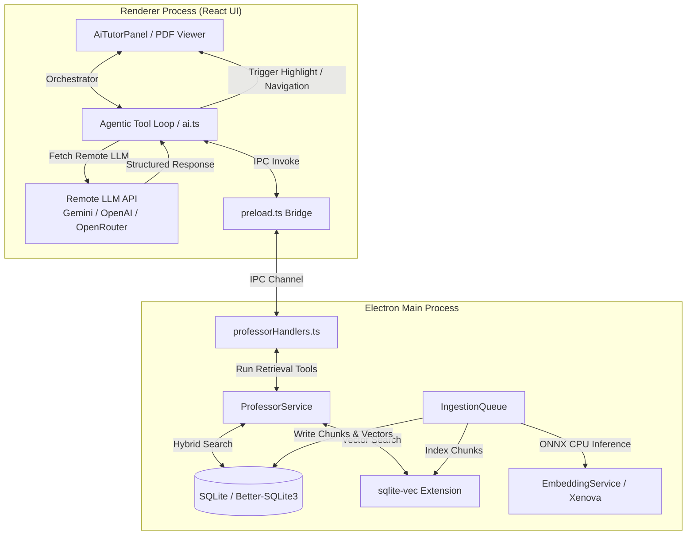
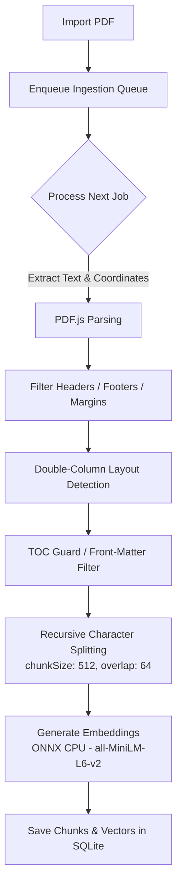
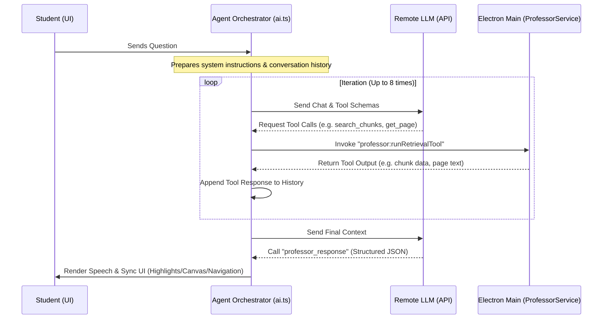

# AI System and Integration Guide

CorvoVault features a local-first AI Tutor Study Assistant designed to help users interact with their imported documents (primarily PDFs) using retrieval-augmented generation (RAG) and an agentic tool-use execution cycle. 

This document explains the architecture of the AI system, its key components, and how it is integrated across the renderer (React UI) and main (Electron) processes.

---

## 1. Architectural Overview

The AI Tutor utilizes a hybrid architecture that splits workloads between the local desktop environment and remote Large Language Models (LLMs). This balances performance, security, and cost-effectiveness.



### Process Separation of Concerns

1. **Renderer Process (Client)**
   - **User Interface**: Renders the tutor chat interface ([AiTutorPanel.tsx](file:///f:/SIC%20v4/CorvoVault/src/components/tabs/AiTutorPanel.tsx)) and controls the PDF viewer canvas.
   - **Agent Orchestration**: Directs the agent tool calling loop ([ai.ts](file:///f:/SIC%20v4/CorvoVault/src/lib/ai.ts)). It manages chat history, formats tool schemas, calls the remote LLM APIs, and triggers UI updates.
   - **Remote LLM Calls**: Executes API requests directly to external models (Gemini, OpenAI, Anthropic, or OpenRouter) using the user's encrypted local API keys.

2. **Main Process (Server)**
   - **Feature Flag Control**: Centralized feature flags in [featureFlags.ts](file:///f:/SIC%20v4/CorvoVault/electron/config/featureFlags.ts) control the RAG subsystem via `isRAGEnabled()`.
   - **Local Ingestion**: Runs a persistent queue ([ingestionQueue.ts](file:///f:/SIC%20v4/CorvoVault/electron/services/ingestionQueue.ts)) to parse PDFs, chunk text, and compute embeddings.
   - **Local Embeddings**: Runs a CPU-based ONNX embedding model locally via `@xenova/transformers` to generate vector representations.
   - **Database Indexing**: Persists document chunks, concepts, session logs, and vector embeddings within SQLite. It executes cosine similarity calculations using the `sqlite-vec` extension.
   - **Tool Execution Service**: Performs data operations through [ProfessorService.ts](file:///f:/SIC%20v4/CorvoVault/electron/services/professorService.ts) when requested by the agent.

---

## 2. Ingestion & Embedding Pipeline

When a user imports a PDF, the app indexes it so that the AI can search and reference it. This ingestion runs in a resilient background queue in the main process.



### Key Phases of Ingestion
- **Verbatim Coordinate Extraction**: Text elements are parsed using `pdfjs-dist`. Along with text content, the exact bounding box coordinates ($X, Y, W, H$) are extracted and normalized to a range of $[0.0 - 1.0]$ relative to the page dimensions.
- **Noise Filtering (Headers/Footers)**: The service scans pages to detect repetitive lines (such as running page numbers, book titles, or section footers) and filters them out to prevent index clutter.
- **Layout & Column Parsing**: If a double-column format is detected, text is extracted column-by-column rather than straight across the page, maintaining reading order.
- **TOC Guard & Heading Heuristics**: The pipeline identifies the Table of Contents pages to skip indexing them as prose, and runs heuristics to identify structural headings to mark chapter/section bounds.
- **Recursive Splitting**: Text is split into chunks of `512` characters with a `64`-character overlap. This fits the strict input token limit (`256` tokens) of the local embedding model, ensuring no text is silently truncated.
- **Local ONNX Embedding**: Generates a 384-dimensional float vector for each chunk using the quantized `Xenova/all-MiniLM-L6-v2` model running locally on the CPU.
- **Storage**: Chunks are written to the SQLite `document_chunks` table, and the embeddings are loaded into the virtual vector table `vec_chunks` managed by `sqlite-vec`.

---

## 3. Search and Retrieval Layer

When a student asks a question, the system retrieves relevant context using a multi-step retrieval mechanism managed by [ProfessorService.ts](file:///f:/SIC%20v4/CorvoVault/electron/services/professorService.ts).

### Retrieval Modes
The service classifies the user's intent to route the retrieval:
- `PAGE_CONTEXT`: Limits search to a window of $\pm 2$ pages around the student's active page.
- `CHAPTER_SUMMARY`: Identifies chapter numbers mentioned in the prompt and queries chunks in those specific chapters.
- `COMPARISON`: Identifies key entities in the question and runs parallel searches to extract text for comparison.
- `FACT_LOOKUP` / `GENERAL_SEMANTIC`: Standard global search across the entire document.

### Hybrid RRF (Reciprocal Rank Fusion)
To ensure high accuracy, the system combines keyword matching and semantic search results using Reciprocal Rank Fusion:

1. **BM25 Search**: Matches exact keywords against all document chunks in SQLite.
2. **Vector Cosine Similarity**: Compares the query embedding with chunk embeddings using `sqlite-vec`.
3. **RRF Scoring**: Combines the rank from both results:
   $$RRF\_Score = \frac{1}{60 + rank_{BM25}} + \frac{1}{60 + rank_{Vector}}$$
4. **Metadata Boosting**: Increases the score of chunks that are near the active page or within the targeted chapter.

---

## 4. The Agentic Tool Loop

Instead of a single-shot RAG call, CorvoVault runs an agent loop. The LLM acts as an investigator that can use tools to search and read different parts of the document before formulating an answer.



### Retrievable Tools Expose
The LLM has access to a collection of navigation and reading tools:
- **`search_chunks(query)`**: Returns chunk IDs, chapter paths, and page numbers matching the query (semantic search). *Note: The model must use a reading tool to retrieve the actual text.*
- **`get_page(page_number)`**: Returns the verbatim text of a page.
- **`get_page_range(start_page, end_page)`**: Scrapes text across a range of pages.
- **`get_topic(topic_name)`** / **`get_section(section_title)`**: Scrapes specific segments indexed by headers.
- **`list_topics()`** / **`list_sections()`**: Returns the document outline to help the LLM navigate.
- **`get_prerequisites(concept_name)`**: Fetches prerequisite relationships from the concept graph.

---

## 5. Structured Output & Visual Synchronization

To provide an interactive teaching experience, the LLM must return its final answer by invoking the `professor_response` tool with a structured JSON payload:

```json
{
  "thinking": "The student is asking about RRF. I need to explain the formula and highlight it on page 14.",
  "speech": "Reciprocal Rank Fusion (RRF) is a method that...",
  "pdf_annotations": [
    {
      "type": "highlight",
      "page": 14,
      "targetText": "RRF_Score = 1 / (60 + rank_BM25) + 1 / (60 + rank_Vector)",
      "color": "orange",
      "chunk_id": "chunk-uuid-1234"
    }
  ],
  "board_actions": [
    {
      "tool": "chalk",
      "content": "RRF Score = sum( 1 / (60 + r) )",
      "position": { "x": 0.5, "y": 0.3 },
      "style": { "color": "white", "size": 20 },
      "timing": 300
    }
  ],
  "navigate_to_page": 14
}
```

### Visual Rendering & Fallbacks
- **Auto-Navigation**: If `navigate_to_page` is specified, the React PDF viewer automatically scrolls to that page.
- **Highlight Matching**: The app matches the `targetText` against the page text in the viewer canvas. It expands ligatures (e.g. `fi` to `fi`) to ensure highlight overlays align correctly.
- **Canvas Whiteboard**: Board actions draw mathematical formulas, notes, or sketches on a canvas overlaying the PDF view.
- **JSON Repair & Fallback**: If the LLM outputs invalid JSON or fails to use the `professor_response` tool (a common issue with free or smaller models), the renderer runs a JSON repair algorithm (`repairJson` in `ai.ts`). If parsing still fails, it wraps the raw text as `{ speech: rawText }` to avoid crashing the UI, although visual features are disabled.

---

## 6. Secrets & Key Storage

Because the LLM runs in the cloud, the user must provide their own API keys. These keys are sensitive and are stored securely using OS-backed encryption:

- **Primary Path**: Electron's `safeStorage` encrypts API keys and saves them locally in `app.getPath('userData')/secrets_store.json`.
- **Fallback Path**: If `safeStorage` is unavailable (e.g., in some Linux environments or unsupported OS configurations), the app falls back to `keytar` or, as a last resort, stores unencrypted credentials in `pin_config.json` while logging a security warning.

---

## 7. Database Schema Reference

The SQLite tables supporting the AI tutor:

```sql
-- Chunks of text extracted from PDFs
CREATE TABLE document_chunks (
  chunk_id TEXT PRIMARY KEY,
  material_id TEXT NOT NULL,
  page INTEGER NOT NULL,
  section TEXT,
  chunk_type TEXT NOT NULL,
  text TEXT NOT NULL,
  bbox_x REAL, bbox_y REAL, bbox_w REAL, bbox_h REAL,
  embedding BLOB, -- Float32 embedding blob
  chunk_order INTEGER NOT NULL,
  created_at INTEGER NOT NULL,
  chapter_id TEXT,
  raw_text TEXT,
  parent_summary_id TEXT,
  is_toc INTEGER NOT NULL DEFAULT 0,
  FOREIGN KEY(material_id) REFERENCES materials(id) ON DELETE CASCADE
);

-- Ingestion state and structural outline of documents
CREATE TABLE concept_index (
  material_id TEXT PRIMARY KEY,
  index_json TEXT NOT NULL DEFAULT '{}',
  status TEXT NOT NULL DEFAULT 'not_started',
  error_message TEXT,
  total_chunks INTEGER DEFAULT 0,
  created_at INTEGER NOT NULL,
  updated_at INTEGER NOT NULL,
  FOREIGN KEY(material_id) REFERENCES materials(id) ON DELETE CASCADE
);

-- Conversation and agenda states per material
CREATE TABLE professor_sessions (
  session_id TEXT PRIMARY KEY,
  material_id TEXT NOT NULL,
  conversation_json TEXT NOT NULL DEFAULT '[]',
  student_model_json TEXT NOT NULL DEFAULT '{}',
  agenda_json TEXT NOT NULL DEFAULT '[]',
  board_state_json TEXT NOT NULL DEFAULT 'null',
  last_page INTEGER NOT NULL DEFAULT 1,
  created_at INTEGER NOT NULL,
  updated_at INTEGER NOT NULL,
  FOREIGN KEY(material_id) REFERENCES materials(id) ON DELETE CASCADE
);

-- Persistent background queue for ingestion jobs
CREATE TABLE ingestion_queue (
  queue_id TEXT PRIMARY KEY,
  material_id TEXT NOT NULL,
  local_path TEXT NOT NULL,
  status TEXT NOT NULL DEFAULT 'waiting',
  priority INTEGER NOT NULL DEFAULT 0,
  attempts INTEGER NOT NULL DEFAULT 0,
  error_message TEXT,
  queued_at INTEGER NOT NULL,
  FOREIGN KEY(material_id) REFERENCES materials(id) ON DELETE CASCADE
);
```
