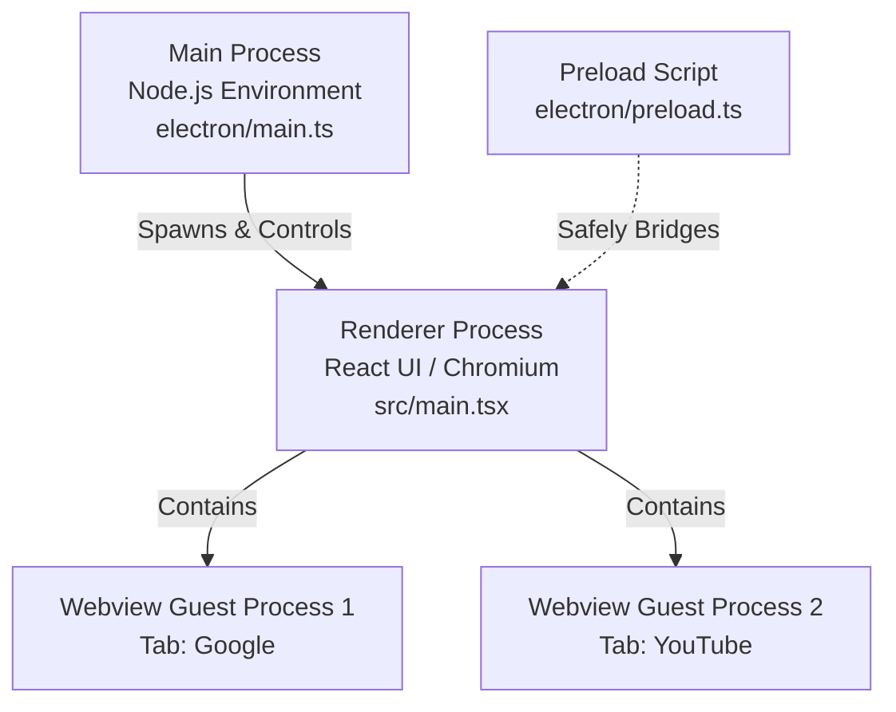

# CorvoVault: In-App Browser Developer Guide & Architecture

This guide explains how CorvoVault handles the in-app Web Browser. It is designed to act as both an architectural audit and an educational document. Whether you are a beginner looking to understand Electron's process model or a maintainer searching for solutions to common integration challenges, this document is for you.

---

## 1. How Electron Works Under the Hood (For Beginners)

To understand how the in-app browser operates, you first need to understand the structural layout of an **Electron application**. 

Unlike standard web applications that run entirely inside a browser sandbox, Electron apps are desktop applications built with web technologies (HTML, CSS, JavaScript). To make this possible, Electron merges two runtimes:
1. **Chromium**: The engine that renders web pages (same as Google Chrome).
2. **Node.js**: The backend environment that has full desktop access (reads/writes files, runs shell commands, connects to databases).

### The Multi-Process Architecture

Electron uses a multi-process architecture to ensure stability and security. If one tab crashes, the whole app does not go down.



1. **The Main Process** (`electron/main.ts`):
   - This is the entry point of your application. It runs in a Node.js environment.
   - It controls the lifecycle of the app, creates browser windows (native desktop windows), and executes privileged tasks (like interacting with the SQLite database).
   - **It has no access to the DOM (Document Object Model) or React states.**
2. **The Renderer Process** (`src/main.tsx`):
   - This is the window you see on the screen. It is running Chromium and rendering your React components.
   - Under security guidelines (`contextIsolation` and `sandbox` enabled), the renderer process **cannot** access Node.js directly. It cannot read files directly from the hard drive or query SQLite without authorization.
3. **The Preload Script** (`electron/preload.ts`):
   - This acts as a security gatekeeper and bridge between the Renderer and Main processes.
   - It exposes selected, safe functions to the React UI using `contextBridge.exposeInMainWorld('electronAPI', {...})`.
   - When the React UI calls `window.electronAPI.openFileDialog()`, the preload script intercepts it and uses `ipcRenderer.invoke` to talk to the Main process.

---

## 2. What is a `<webview>`?

A webview is a custom HTML tag (`<webview>`) provided by Electron that lets you embed guest content (like external websites) inside your application. 

Think of it as a super-powered `<iframe>`. While an `iframe` runs inside the same renderer process as your React application (making it subject to strict Cross-Origin constraints and able to crash your main UI), a `<webview>` runs in an entirely separate **guest renderer process**. 

This isolation provides two critical benefits:
- **Security**: The external site cannot access your app's memory, SQLite database, or electron APIs.
- **Crash Protection**: If a heavy webpage crashes, only that webview tab crashes; your main CorvoVault app stays responsive.

---

## 3. Deep Dive: CorvoVault Browser Implementation

The in-app browser implementation in CorvoVault is divided into a React frontend component and Electron configuration layers.

### The React Component

The UI for managing tabs, history, and search inputs is located in [Browser.tsx](file:///f:/SIC%20v4/study-in-center/src/components/Browser.tsx).

- **Tab State**: Managed using a standard React array of `Tab` objects (containing IDs, titles, URLs, and loading flags).
- **Webview References**: To control the Chromium webviews (e.g., navigating back, reloading, zooming), React uses `useRef<Record<string, any>>({})` to store references to the raw DOM elements.
- **Background Persistence**: In the render loop, all opened tabs are mapped to `<webview>` components. Instead of unmounting a tab when you switch to another one, the app toggles the CSS `hidden` property:
  ```tsx
  <div key={tab.id} className={`absolute inset-0 ${activeTabId === tab.id ? '' : 'hidden'}`}>
     <webview ... />
  </div>
  ```
  This keeps the page state (scroll position, inputs, logins) intact when switching back and forth.

### Preload & Main IPC Handlers

For browser-wide actions that require Node.js-level capability, the renderer talks to the main process:
1. In [preload.ts](file:///f:/SIC%20v4/study-in-center/electron/preload.ts), the browser utilities are exposed:
   ```ts
   clearBrowserCache: () => ipcRenderer.invoke('browser:clearCache'),
   openDevTools: () => ipcRenderer.invoke('browser:openDevTools'),
   ```
2. In [main.ts](file:///f:/SIC%20v4/study-in-center/electron/main.ts), these calls are handled:
   - **`browser:clearCache`**: Dynamically accesses the session object for the specific partition and clears cookies, localStorage, and cache databases:
     ```ts
     const browserSession = session.fromPartition('persist:browser');
     await browserSession.clearCache();
     await browserSession.clearStorageData({ storages: ['cookies', 'localstorage', 'indexdb'] });
     ```
   - **`browser:openDevTools`**: Opens the developer console for inspecting webview content (only enabled in development mode `isDev`).

---

## 4. Common Browser Problems & How CorvoVault Solves Them

Building an in-app browser reveals several quirks in Electron and Chromium. Here is how CorvoVault handles the most common ones:

### Problem 1: YouTube Playback Performance & "Black Screen" Bugs
By default, Electron background throttles renderers that are out of focus or hidden. When YouTube runs inside a webview, it may pause, freeze, or display a black screen because Electron starves it of CPU cycles. Additionally, modern browsers block audio/video autoplay unless the user interacts with the page.

**Solution**:
In [Browser.tsx](file:///f:/SIC%20v4/study-in-center/src/components/Browser.tsx), the `<webview>` specifies customized `webpreferences` and a Desktop User Agent (UA) specifically for YouTube:
```tsx
webpreferences={(tab.url?.includes('youtube.com')) ? 'autoplayPolicy=no-user-gesture-required, backgroundThrottling=false' : undefined}
useragent={(tab.url?.includes('youtube.com')) ? 'Mozilla/5.0 (Windows NT 10.0; Win64; x64) AppleWebKit/537.36 (KHTML, like Gecko) Chrome/122.0.0.0 Safari/537.36' : undefined}
```
- `backgroundThrottling=false` forces Electron to keep feeding CPU cycles to YouTube even if the tab is hidden, keeping audio playing.
- `autoplayPolicy=no-user-gesture-required` bypasses user interaction locks.
- A modern desktop User Agent is sent to prevent YouTube from loading simplified mobile pages or throwing embedded-player limitations.

### Problem 2: Clicking Links Spawns Empty Popups or Fails to Open
Many sites use `target="_blank"` or window popup scripts. In a standard `<webview>`, clicking these links will either do nothing, crash the guest process, or spawn an unstyled empty floating window.

**Solution**:
CorvoVault registers listeners on the webview DOM elements:
```ts
const onNewWindow = (e: any) => {
  const popupUrl = e.url || e.detail?.url;
  if (!popupUrl) return;
  
  // Intercept downloads/files (see Problem 3)
  if (isDocument(popupUrl)) {
    window.electronAPI.openExternal(popupUrl);
    return;
  }
  
  // Open the new URL inside a brand new React browser tab
  createNewTab(popupUrl);
};
webview.addEventListener('new-window', onNewWindow);
```

### Problem 3: Users Clicking PDF, Word, or Executable Downloads
If a user clicks a download link (like a `.docx` or `.zip` file) in a simple webview, Chromium tries to download it or display binary garbage on screen. Because the webview doesn't have a download UI manager, the download quietly fails, leaving the user confused.

**Solution**:
The app inspects URLs before they start loading. If the URL points to a document format (like `.docx`, `.xlsx`, `.zip`, `.exe`), it prevents the webview from loading it and opens it using the OS shell instead:
```ts
const onWillNavigate = (e: any) => {
  const url = e.url;
  if (/\.(docx?|odt|rtf|pptx?|xlsx?|zip|rar|tar|gz|exe|msi)$/i.test(url)) {
    e.preventDefault(); // Stop the webview from navigating
    window.electronAPI.openExternal(url); // Open in external default browser
  }
};
webview.addEventListener('will-navigate', onWillNavigate);
```

---

## 5. Honest View: Known Problems & Architectural Debt

While the browser is functional, it suffers from several architectural issues that developers should be aware of:

> [!WARNING]
> **Electron `<webview>` Tag Deprecation**
> The Electron core team has deprecated the `<webview>` tag. It is prone to rendering bugs, suffers from poor performance, and is difficult to secure. Electron now recommends using `BrowserView` or `WebContentsView` (where the main process controls a separate overlay window positioned exactly over the UI).
> 
> *Why CorvoVault uses it:* Integrating `BrowserView` requires complex, manual resize-calculations in the Main process matching the React layout coordinates. `<webview>` behaves like a standard HTML element, making it much easier to integrate into React grids and panels.

### The RAM Leak Problem
Each `<webview>` in the DOM runs a separate OS-level process. Because CorvoVault hides background tabs using CSS `hidden` rather than unmounting them, **all processes remain active in memory**. 
- Open 1 tab: ~150 MB RAM.
- Open 10 tabs: ~1.5 GB RAM.
- The webview processes are never garbage-collected or discarded until the tab is explicitly closed.

### Event Listener Cleanup Complexity
In [Browser.tsx](file:///f:/SIC%20v4/study-in-center/src/components/Browser.tsx), the React code uses a ref callback to capture the webview DOM node and register listeners. If React re-renders or updates state, these callbacks can run again, potentially accumulating duplicate listeners or failing to clear old ones, leading to memory leaks inside the React DOM tree.

---

## 6. How a Beginner Can Contribute

If you are a beginner looking to write your first lines of code in CorvoVault, the Browser is an excellent place to start! Here are three entry-level features you can build:

### Contribution Idea A: Implement a "Tab Reload Indicator"
*Difficulty: Easy*
Currently, when a tab is reloading, a small loading spinner is shown next to the URL input. However, the tab title itself doesn't show loading feedback.
1. Open [Browser.tsx](file:///f:/SIC%20v4/study-in-center/src/components/Browser.tsx).
2. Find the tab rendering code (around line 490).
3. Check `tab.isLoading`. If true, replace the `<Globe>` icon on the tab with a spinning `<Loader2>` icon from Lucide-React.

### Contribution Idea B: Add a "Tab History Navigation List" (Right-Click Back Button)
*Difficulty: Medium*
Browsers allow you to right-click the back button to see a dropdown history of pages you visited.
1. Electron's webview API has `webContents.getNavigationHistory()` or you can track URL changes in `did-navigate` listeners.
2. Build a small React dropdown portal that triggers when holding down or right-clicking the back/forward buttons, letting the user jump back 3 pages at once.

### Contribution Idea C: Implement Lazy Tab Discarding (RAM Fix!)
*Difficulty: Hard*
To fix the RAM problem, you could build a background tab discarder.
1. Keep track of the `lastActiveTime` of each tab.
2. If the application memory is climbing, or if a tab has been hidden for more than 15 minutes, unmount the `<webview>` element from the React tree but **save its last loaded URL** in the React state.
3. When the user clicks the tab again, recreate the `<webview>` and load that URL. The tab will reload, but it saves hundreds of megabytes of RAM while inactive!
