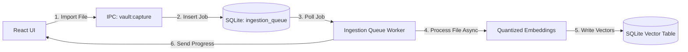

# CorvoVault: Performance, Memory (RAM), & Speed Optimization Guide

This document explains how CorvoVault manages memory, resource consumption, and database speed. It details the app's performance strategies, analyzes core bottlenecks, and provides an educational primer on how Electron processes consume resources under the hood.

---

## 1. The Electron RAM Overhead: Why Desktop Apps Consume Memory

Many users and developers ask: *"Why does a simple desktop app use 300 MB to 1 GB of RAM?"* 

To understand this, you must look at how **Chromium** (the engine behind Google Chrome and Electron) is designed. 

### Chromium's Process Model

Chromium isolates tasks into separate Operating System (OS) processes. When you run CorvoVault, your computer starts several processes in the background:

```text
[CorvoVault.exe] (Main Process)
   ├── [CorvoVault.exe] (GPU Helper Process - handles animations & rendering)
   ├── [CorvoVault.exe] (Renderer Process - runs React UI, DOM, and Javascript)
   ├── [CorvoVault.exe] (Network/Utility Processes)
   └── [CorvoVault.exe] (Guest Renderer Process - Webview Tab 1)
   └── [CorvoVault.exe] (Guest Renderer Process - Webview Tab 2)
```

Each process has its own:
- **V8 Engine Instance**: The engine that compiles and runs JavaScript code.
- **Memory Heap**: The memory sandbox where variables, images, and DOM structures are stored.
- **Render Pipelines**: Systems that draw pixels on your screen.

Because these processes do not share memory directly, Electron apps have a high base RAM footprint. A blank window consumes roughly 120–200 MB of RAM just to spin up the Chromium wrapper.

---

## 2. Core Performance Systems in CorvoVault

To keep the application light, fast, and responsive, CorvoVault implements several key optimizations across its database, startup lifecycle, and background jobs.

---

### A. SQLite Optimization (WAL & Normal Sync)

CorvoVault stores metadata, bookmarks, profiles, and annotations in a local SQLite database located in the user's data directory:
`app.getPath('userData')/corvovault.db`

By default, SQLite works in **Rollback Journal Mode** with **Full Synchronous commits**. This means every time the app writes to the database, SQLite locks the entire database and waits for the hard drive to physically write the data to the disk platter before continuing. This causes noticeable stuttering in desktop UIs.

**CorvoVault's Solution**:
In [connection.ts](file:///f:/SIC%20v4/study-in-center/electron/db/connection.ts), the database is initialized with two performance-tuning PRAGMAs:
```sql
PRAGMA journal_mode = WAL;
PRAGMA synchronous = NORMAL;
```

1. **Write-Ahead Logging (WAL)**:
   - Instead of modifying the main database file directly on every write, changes are appended to a separate companion log file (the `.db-wal` file).
   - This allows **concurrent reads and writes**: React can read materials from the database at the same time a background queue is writing new search vectors. Readers never block writers, and writers never block readers.
2. **Synchronous = NORMAL**:
   - SQLite does not wait for the physical hard disk to flush data on every write; instead, it delegates disk syncing to the operating system's write cache.
   - This speeds up insert/update queries by **10x to 50x**, preventing write operations from blocking application flow.

---

### B. Asynchronous Ingestion Queue

When a user imports a PDF, the app must:
1. Extract the text page-by-page.
2. Segment the text into logical chunks.
3. Generate 384-dimensional vector embeddings for each chunk.
4. Save the chunk texts and vector blobs into SQLite.

If this work was done inside the React UI process, the app's interface would freeze completely, dropping to 0 frames-per-second (FPS) during ingestion.

**CorvoVault's Solution**:
CorvoVault delegates this work to an asynchronous main process queue ([ingestionQueue.ts](file:///f:/SIC%20v4/study-in-center/electron/services/ingestionQueue.ts)):



1. The UI imports a file and calls the IPC channel.
2. The main process inserts a row into the `ingestion_queue` table with a status of `'waiting'`. The IPC call returns immediately. The UI remains fully responsive.
3. A background loop polls the queue, loading, parsing, and embedding chunks sequentially.
4. The background queue pushes progress events (`professor:ingestionProgress`) back to the React UI, which updates a progress bar.

---

### C. Quantized Local AI Models

To support vector search without relying on expensive and slow cloud services, CorvoVault runs embedding calculations locally on the user's CPU using `@xenova/transformers`.

**Optimizations**:
- **Cached Models**: The embedding model files (`all-MiniLM-L6-v2`) are downloaded once and cached under `userData/ai-models/`, avoiding network delays.
- **Quantization**: The model is quantized (8-bit integers instead of 32-bit floats). This reduces the model file size to just **~23 MB** and decreases RAM consumption by **75%** during embedding generation without significant loss in search accuracy.

---

### D. Pandoc & Preview Cache

Converting complex formats (like Microsoft Word `.docx`, `.odt`, or `.rtf`) into readable documents requires launching an external `pandoc.exe` executable, converting the document to HTML, loading it inside a hidden background window, and printing it to a PDF file. This process takes 2 to 5 seconds.

**Optimization**:
To avoid repeating this heavy conversion, CorvoVault caches the converted PDFs in the `userData/previews/` folder.
- When opening a document, the app checks if a preview already exists.
- If it does, the app serves the cached file instantly through its custom `corvovault-file://` protocol, bypassing the conversion process entirely.

---

## 3. Honest View: Performance Bottlenecks & Weaknesses

While the app uses standard optimizations, there are several architectural choices that cause performance degradation and high RAM usage under heavy workloads:

### 1. The React Webview RAM Leaks
As detailed in the [In-App Browser Guide](file:///f:/SIC%20v4/study-in-center/docs/IN_APP_BROWSER_GUIDE.md), every open browser tab is kept in the React DOM. It is merely hidden with CSS (`display: none`). 
- **The Issue**: Hidden tabs continue to run separate Chromium OS processes, consuming roughly 150 MB of RAM per tab.
- **The Result**: Opening 8–10 tabs can drive the application's RAM usage past 1.5 GB.

### 2. Synchronous Database Thread Blocking
The app uses `better-sqlite3` in the Main Process. While `better-sqlite3` is extremely fast because it runs in-process without network overhead, **it is entirely synchronous**.
- **The Issue**: Every query blocks the Node.js event loop in the Main Process.
- **The Result**: If a user runs a complex SQLite query (like searching thousands of vector chunks or running a heavy transaction), the entire Main Process halts. Since the Main Process handles window dragging, resizing, and IPC routing, the application window will freeze visually for the duration of the query.

### 3. CPU Spikes During Local Ingestion
Running `@xenova/transformers` embeddings locally uses ONNX Runtime. Because the model calculations run on the CPU within the main node thread:
- **The Issue**: During PDF text ingestion, CPU usage will spike to 100% on the active thread.
- **The Result**: On low-end or battery-powered laptops, this causes the cooling fans to spin up and causes general system lag while heavy textbooks are being indexed.

---

## 4. How a Beginner Can Contribute to Performance

Performance tuning is an excellent way to learn database design, process management, and resource optimization. Here are three tasks a beginner can tackle:

### Task A: Write a Migration to Add a SQLite Index
*Difficulty: Easy*
When the app searches materials by their folder or profile, SQLite has to scan every row if there are no indexes. Adding indexes speeds up queries significantly.
1. Open [migrate.ts](file:///f:/SIC%20v4/study-in-center/electron/db/migrate.ts).
2. Look at how tables are constructed and how indexes are created (e.g., `CREATE INDEX IF NOT EXISTS ...`).
3. Find a column that is queried often but lacks an index (for example, `trashed_at` on the `materials` table).
4. Write a new migration step in `migrate.ts` to create the index, improving list loading speeds for large vaults.

### Task B: Optimize Inactive Tabs (Lazy Sleeping)
*Difficulty: Medium*
Reduce RAM overhead by putting inactive browser tabs to sleep.
1. Open [Browser.tsx](file:///f:/SIC%20v4/study-in-center/src/components/Browser.tsx).
2. Modify the tab state to store the tab's HTML webview reference ONLY when active.
3. If a tab is inactive for more than 10 minutes, unmount the `<webview>` element. When the user clicks the tab again, mount it back and reload the URL. This instantly frees 150 MB of RAM per inactive tab.

### Task C: Move Embedding Logic to a Worker Thread
*Difficulty: Hard*
Prevent embedding generation from locking the Main Process event loop by offloading it to a background worker.
1. Use Node's built-in `worker_threads` module.
2. Move the `@xenova/transformers` initialization and embedding calculation from `ingestionQueue.ts` into a separate worker file (e.g., `embedding.worker.js`).
3. Communicate between the ingestion queue and the worker thread using `postMessage`. This keeps the Main Process responsive even while the CPU is executing complex mathematical calculations.
