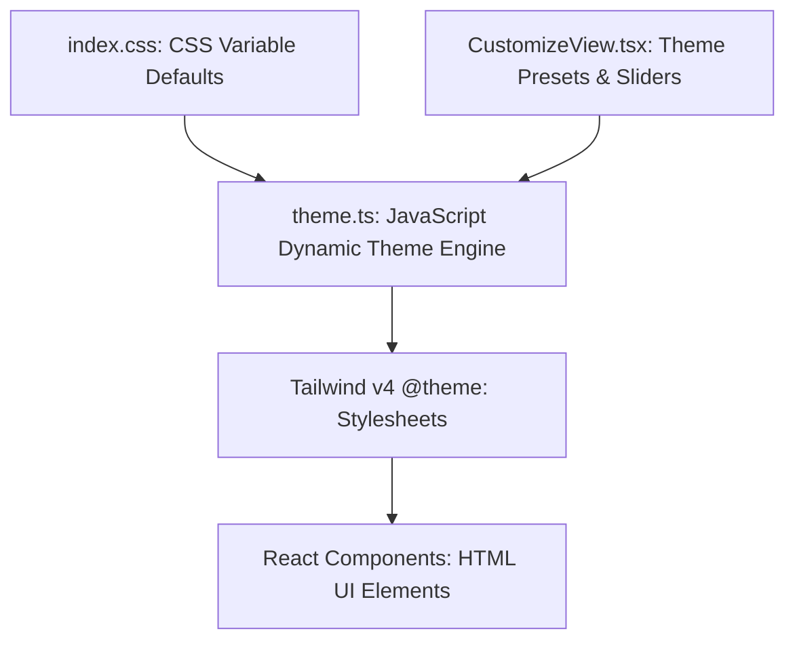

# CorvoVault Theme & UI/UX Design Guide

Welcome to the **CorvoVault** UI/UX Design & Theming guide! This document is created specifically for designers and developers (including absolute beginners) who want to customize, refine, or completely overhaul the visual styling and color scheme of the application.

> [!WARNING]
> **Design Feedback on Current Colors:**  
> The current default colors are **"totally popping" (bad)**. They are overly saturated, neon-like, or high-contrast in a way that creates a high cognitive load. For a reading, studying, and notes app like CorvoVault, the color palette should be **subdued, harmonious, premium, and easy on the eyes** (e.g., calming slates, deep grays, soft warm tones, and readable contrasts rather than aggressive pops).

---

## 🗺️ Visual Architecture Map

CorvoVault handles colors dynamically. Instead of hardcoded colors, it uses **CSS Variables** defined in a global CSS sheet and managed by a JavaScript engine. This means you can change a single color code in **one place**, and it will update the entire app instantly!

Here is how the styles flow:


---

## 🎨 Core Design Tokens (What the variables mean)

Every color in the application maps to a variable. To prevent developer and designer confusion, please note that **the Tailwind class mappings redirect some of these variables**:

| CSS Variable | Friendly Name | Description / Actual Behavior in App |
| :--- | :--- | :--- |
| `--bg` | **App Background** | The main canvas color of the application. Keep it very soft (warm white or deep dark-slate). |
| `--bg-elev` | **Elevated Background** | Used for panels that sit on top of the main background (like the sidebar). |
| `--card` | **Card Surface** | Used for containers, cards, and modals. Usually white in light mode, or a slightly lighter gray/slate in dark mode. |
| `--accent` | **Visual Primary / Brand Accent** | **IMPORTANT:** This variable controls the actual brand accent color in the UI. In our Tailwind setup, `bg-primary`, `bg-secondary`, `bg-accent`, `text-primary`, `text-secondary`, and `text-accent` all map to this `--accent` color! *This is the color that currently pops too much!* |
| `--primary-contrast`| **Text on Primary / Accent** | The color of text/icons displayed *directly on top* of the accent/brand elements (usually white `#ffffff` or dark `#000000`). Maps to Tailwind's `text-on-primary` and `text-on-secondary`. |
| `--text` | **Main Text** | Used for headers and body copy. Avoid pure black `#000000` to prevent eye strain. |
| `--muted` | **Muted Text** | Used for subheaders, timestamps, and placeholder text. |
| `--primary` | **Secondary Custom Accent** | **NOTE:** This variable is NOT used for standard Tailwind `bg-primary` classes. It is used as a fallback/independent token in custom non-Tailwind styled elements (like the Design Playground active tab and custom buttons). |
| `--border` | **Border / Divider** | The color of lines dividing sections. Keep this very low-contrast to avoid "grid lock" (lines everywhere). |
| `--success` | **Success State** | Green color used for successful completions or green tags. |
| `--danger` | **Danger State** | Red color used for errors, delete buttons, or alerts. |

---

## 🔗 Tailwind CSS v4 Class Mappings (Reference for Programmers)

To make styling intuitive with Tailwind utility classes, the React frontend maps the utility classes to our dynamic CSS variables via the `@theme` block in `src/index.css` and the JS engine in `src/lib/theme.ts`. Refer to this table when styling components:

| Tailwind Class | Maps to CSS Variable | Maps to Derived State |
| :--- | :--- | :--- |
| `bg-primary` / `text-primary` | `var(--accent)` | Brand Accent |
| `bg-secondary` / `text-secondary` | `var(--accent)` | Brand Accent |
| `bg-accent` / `text-accent` | `var(--accent)` | Brand Accent |
| `text-on-primary` / `text-on-secondary` | `var(--primary-contrast)` | Accent Foreground Text |
| `bg-surface` | `var(--bg)` / `var(--color-base-00)` | App Background |
| `bg-surface-dim` / `bg-surface-container` | `var(--bg-elev)` / `var(--color-base-05)` | Elevated background panels / Sidebars |
| `text-on-surface` | `var(--text)` / `var(--color-base-100)` | Main text color |
| `text-on-surface-variant` | `var(--muted)` / `var(--color-base-50)` | Muted text color |
| `border-outline` | `var(--border)` / `var(--color-base-20)` | Dividers / Outline |

---

## 🛠️ Step-by-Step: How to Edit the Colors

Even if you have **never coded before**, you can edit these files using a simple text editor (like VS Code). Follow these guides:

### Step 1: Changing the Default Launch Theme
When a user opens CorvoVault for the first time, it loads the default theme.
* **File to open:** [src/lib/theme.ts](file:///f:/SIC%20v4/study-in-center/src/lib/theme.ts)
* **What to look for:** Find the `DEFAULT_THEME` object at the very top of the file:
```typescript
export const DEFAULT_THEME: Record<string, string> = {
  '--bg': '#f8fafc',
  '--bg-elev': '#f1f5f9',
  '--card': '#ffffff',
  '--primary': '#1e293b', // Used in custom styled components/playground
  '--primary-contrast': '#ffffff',
  '--text': '#0f172a',
  '--muted': '#64748b',
  '--accent': '#3b82f6', // Controls primary brand accent in Tailwind
  '--danger': '#ef4444',
  '--success': '#22c55e',
  '--border': '#e2e8f0',
  // ...
};
```
* **How to edit:** Replace the hex codes (e.g., `#f8fafc`) with your desired color hex codes.

---

### Step 2: Changing the Fallback Global Styles
In case the JavaScript engine hasn't loaded yet, the browser uses the fallback CSS.
* **File to open:** [src/index.css](file:///f:/SIC%20v4/study-in-center/src/index.css)
* **What to look for:** Look for the `:root` block:
```css
:root {
  --bg: #f8fafc;
  --bg-elev: #f1f5f9;
  --card: #ffffff;
  --primary: #1e293b;
  --primary-contrast: #ffffff;
  --text: #0f172a;
  --muted: #64748b;
  --accent: #3b82f6;
  --danger: #ef4444;
  --success: #22c55e;
  --border: #e2e8f0;
  // ...
}
```
* **How to edit:** Update these values to match your custom theme colors from Step 1.

---

### Step 3: Changing the Preset Themes (Mango, Lichi, Coffee, etc.)
The app provides a "Customize Space" tab where users can choose prebuilt vibes. Some of these are currently popping/harsh and need refinement.
* **File to open:** [src/components/tabs/CustomizeView.tsx](file:///f:/SIC%20v4/study-in-center/src/components/tabs/CustomizeView.tsx)
* **What to look for:** Scroll to the `PREBUILT_PALETTES` array:
```typescript
const PREBUILT_PALETTES = [
  { name: 'Mango', emoji: '🥭', hue: 38, style: 'warm' as ThemeStyle, colors: [hsl(38, 75, 42), hsl(38, 30, 97), hsl(218, 70, 48)] },
  { name: 'Lichi', emoji: '🍈', hue: 355, style: 'light' as ThemeStyle, colors: [hsl(355, 70, 40), hsl(355, 20, 97), hsl(175, 75, 50)] },
  { name: 'Blackberry', emoji: '🫐', hue: 270, style: 'dark' as ThemeStyle, colors: [hsl(270, 80, 65), hsl(270, 20, 8), hsl(90, 80, 60)] },
  // ...
];
```
* **How to edit:**
  1. Each palette uses a **Base Hue** (0 to 360) and a **Style Vibe** (`'light' | 'dark' | 'warm' | 'cool' | 'bold' | 'crow' | 'night'`).
  2. The actual generation formulas (like how the colors are derived from the Base Hue) are located in [src/lib/themeGenerator.ts](file:///f:/SIC%20v4/study-in-center/src/lib/themeGenerator.ts).
  3. For custom static presets (like `Crow` and `Night`), you can pass direct hex codes as an array:
     ```typescript
     { name: 'Crow', emoji: '🐦‍⬛', hue: 270, style: 'crow' as ThemeStyle, colors: ['#4F46E5', '#0F1115', '#FCD34D'] }
     ```

---

## 🎨 Rules for Designing a "Premium" Theme

To prevent colors from "popping" in a bad way and achieve a premium, high-quality look:

1. **Use Harmonious Color Palettes:**
   * Instead of saturated red (`#ff0000`) or primary blue (`#0000ff`), use slate-based accents like Indigo (`#6366f1`), Lavender (`#8b5cf6`), or Emerald (`#059669`).
2. **Avoid Harsh Contrasts:**
   * Instead of pure white (`#ffffff`) on pure black (`#000000`) for dark mode, use deep navy/charcoal bases (like `#0b0f19` or `#121214`) and off-white/gray text (`#e2e8f0` or `#cbd5e1`).
3. **Establish a Visual Hierarchy:**
   * The background should recede. Accent colors should be reserved ONLY for interactive elements like buttons, badges, and focus frames.
4. **Soft Border Lines:**
   * Borders should be barely visible (e.g., `rgba(0, 0, 0, 0.05)` or `#e2e8f0` on light background). Harsh, dark borders around elements look dated and busy.

---

## 🚀 How to View Your Changes Live

1. Open your terminal in the project directory.
2. Run the development server:
   ```bash
   npm run electron:dev
   ```
3. The application window will open. Any changes you make to the CSS or theme files will reload instantly so you can review them in real time!
